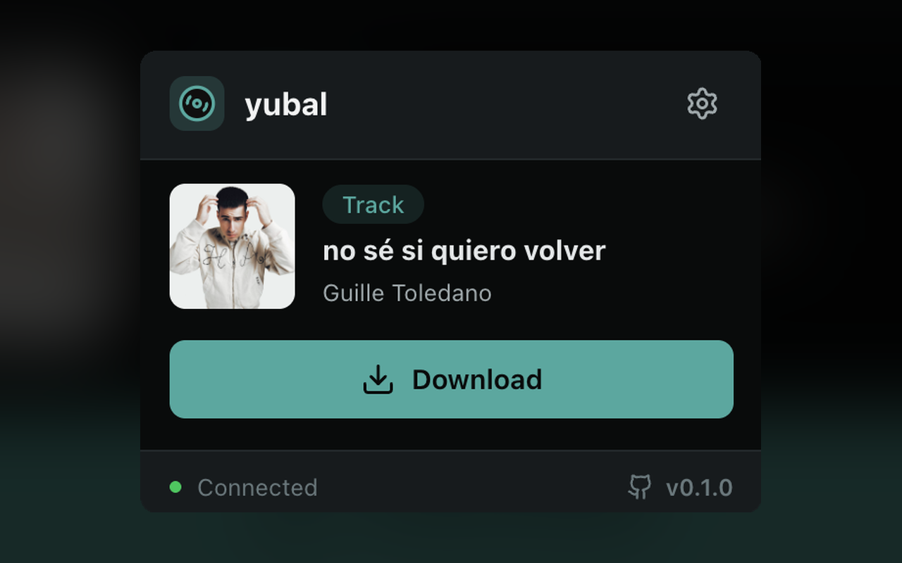
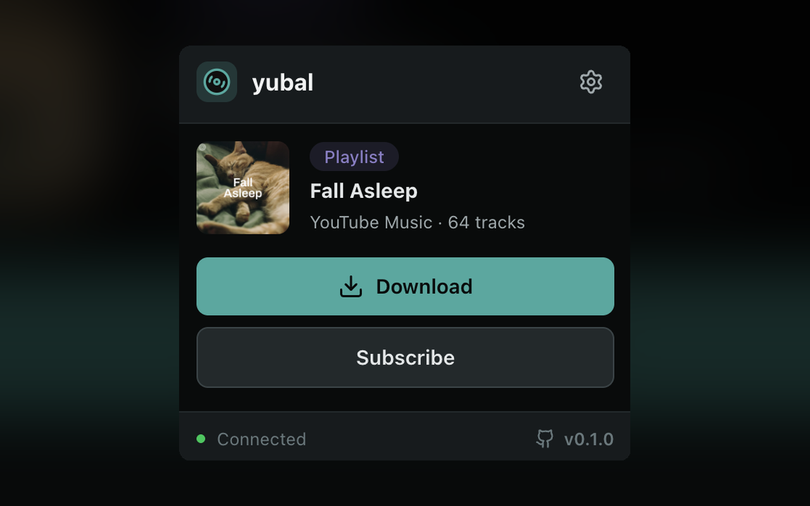
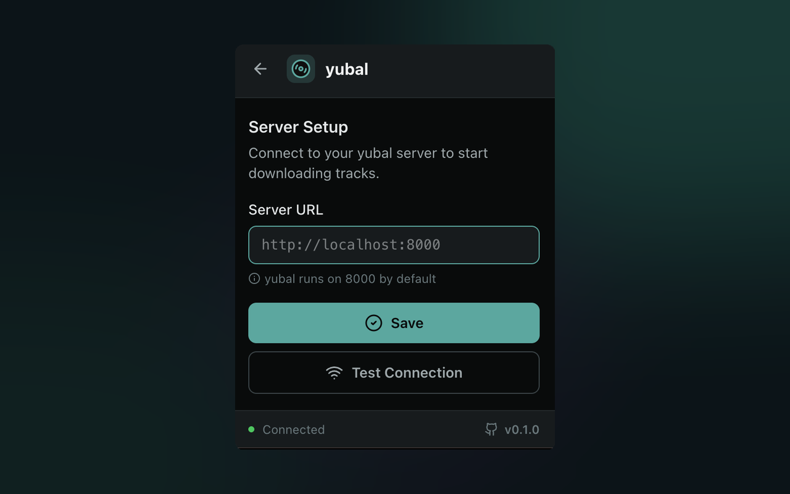

# yubal browser extension

Browser extension for Chrome and Firefox that lets you send YouTube and YouTube Music URLs to your [yubal](https://github.com/guillevc/yubal) instance for downloading.

<p align="center">
  
  
  
</p>

## Install from releases

Pre-built zips are available on the [releases page](https://github.com/guillevc/yubal/releases?q=ext-v). Download the zip for your browser and follow the instructions below to install it.

### Verify build integrity

Release zips include signed build attestations generated by GitHub Actions. You can verify that a zip was built by CI and hasn't been tampered with:

```bash
gh attestation verify yubal-extension-*.zip -R guillevc/yubal
```

### Chrome

1. Download the `-chrome.zip` file from the release and extract it
2. Open `chrome://extensions/`
3. Enable **Developer mode** (toggle in the top right)
4. Click **Load unpacked** and select the extracted folder

See [Chrome's documentation](https://developer.chrome.com/docs/extensions/get-started/tutorial/hello-world#load-unpacked) for more details.

### Firefox

1. Download the `-firefox.zip` file from the release
2. Open `about:addons`
3. Click the gear icon and select **Install Add-on From File...**
4. Select the downloaded zip file

See [Firefox's documentation](https://extensionworkshop.com/documentation/develop/temporary-installation-in-firefox/) for more details.

## Build from source

Prerequisites: [bun](https://bun.sh).

```bash
bun install              # install dependencies
bun run zip              # build Chrome zip
bun run zip:firefox      # build Firefox zip
```

Output zips are written to `.output/`.

## Development

```bash
bun run dev              # Chrome dev mode with hot reload
bun run dev:firefox      # Firefox dev mode with hot reload
```
