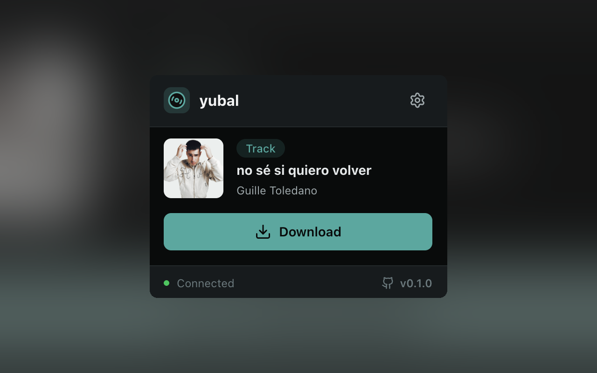
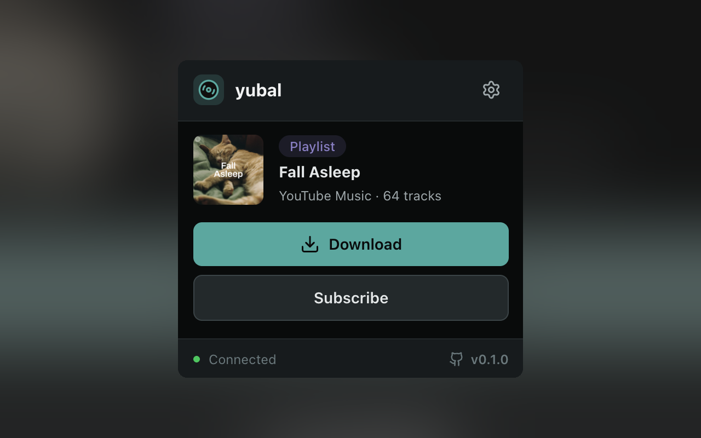
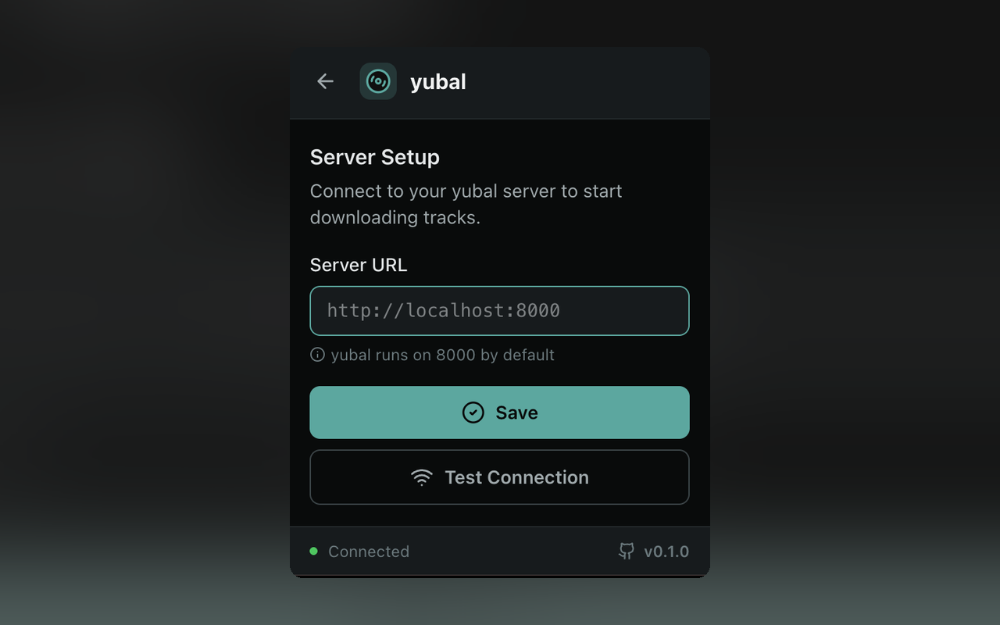

# yubal browser extension

Browser extension for Chrome and Firefox that lets you send YouTube and YouTube Music URLs to your [yubal](https://github.com/guillevc/yubal) instance for downloading.

<p align="center">
  
  
  
</p>

## Features

- Download tracks directly from YouTube and YouTube Music pages
- Subscribe to playlists and albums for automatic syncing
- Configurable yubal instance URL
- Icon grays out on non-YouTube pages

## Install

Pre-built zips for both browsers are available on the [releases page](https://github.com/guillevc/yubal/releases?q=ext-v).

### Firefox

**(Recommended)** Install from [Firefox Add-ons](https://addons.mozilla.org/en-US/firefox/addon/yubal/).

Alternatively, to install from a release zip:

1. Go to the [latest extension release](https://github.com/guillevc/yubal/releases?q=%F0%9F%A7%A9) and download the `-firefox.zip` file
2. Open `about:debugging#/runtime/this-firefox`
3. Click **Load Temporary Add-on...** and select the zip

> [!NOTE]
> Temporary add-ons are removed when Firefox is closed. See [Firefox's documentation](https://extensionworkshop.com/documentation/develop/temporary-installation-in-firefox/) for more details.

### Chrome

The extension is not yet available on the Chrome Web Store. To install from a release zip:

1. Go to the [latest extension release](https://github.com/guillevc/yubal/releases?q=%F0%9F%A7%A9), grab the `-chrome.zip` file and extract it
2. Open `chrome://extensions/`
3. Enable **Developer mode** (toggle in the top right)
4. Click **Load unpacked** and select the extracted folder

See [Chrome's documentation](https://developer.chrome.com/docs/extensions/get-started/tutorial/hello-world#load-unpacked) for more details.

<details>
<summary>Verify build integrity</summary>

Release zips include signed build attestations generated by GitHub Actions. You can verify that a zip was built by CI and hasn't been tampered with:

```bash
gh attestation verify yubal-extension-*.zip -R guillevc/yubal
```

</details>

## Build from source

Prerequisites: [Bun](https://bun.sh).

```bash
bun install              # install dependencies
bun run zip              # build Chrome zip
bun run zip:firefox      # build Firefox zip
```

Output zips are written to `.output/`.
